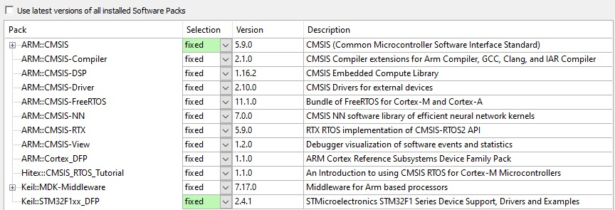

# ECOS03 & ECOS13 - Sistemas Operacionais Embarcados

Este repositório contém materiais de apoio para as disciplinas **ECOS03 - Sistemas Operacionais Embarcados** e **ECOS13 - Laboratório de Sistemas Operacionais Embarcados**.

## ⚠️ Aviso Importante

**Sempre fique atento ao que seu professor posta na plataforma SIGAA.**
Este repositório é complementar e composto por materiais coletados quando o monitor cursou as disciplinas. **Todo o conteúdo aqui disponível não substitui o material oficial e as instruções fornecidas pelos professores.**

---

## 🎯 Objetivos das Disciplinas

Ao final destas disciplinas, o aluno deve ser capaz de:

*   Descrever a estrutura de um RTOS (Real-Time Operating System).
*   Utilizar sistemas de proteção e sincronização como **Mutex**.
*   Utilizar ferramentas para geração de imagem de Sistemas Operacionais.
*   Implementar **drivers** para um RTOS.
*   Analisar requisitos para o uso de RTOS e SO de propósito geral em projetos embarcados.
*   Avaliar requisitos de tarefas com restrições de **tempo real**.

---

## 📚 Materiais de Apoio por Tópico

### 1. Introdução ao FreeRTOS e Configuração do Ambiente
*   **Vídeo Tutorial de Instalação:¹** [Assistir no YouTube](https://youtu.be/DoGPWF8iJy0)
    *   **Pré-requisitos:**
        1.  Microsoft Visual C++: [Download](https://www.microsoft.com/pt-br/download/details.aspx?id=48145)
        2.  STM32 Link Utility: [Download](https://www.st.com/en/development-tools/stsw-link004.html#get-software)
        3.  Ambiente de Desenvolvimento Keil MDK: [Download](https://www.keil.com/download/product/)

### Versões Testadas e Configuração Recomendada

Configurar o ambiente de desenvolvimento (toolchain) é uma etapa crítica. Para evitar problemas de compatibilidade, **utilize as mesmas versões de software e pacotes que foram testados e validados**.

*   **µVision (Keil MDK):** A versão testada e que funciona perfeitamente com os materiais deste repositório é a **µVision V5.42.0.0**.
    *   *Versões mais recentes podem funcionar, mas é altamente recomendado usar esta versão específica para garantir compatibilidade total com os exemplos e laboratórios.*

*   **Pacotes (Software Packs) Instalados:**
    Os seguintes pacotes, nas versões listadas, estão funcionando corretamente com a placa e os exemplos:



**Como verificar/instalar os pacotes no Keil:**
1.  Abra o µVision.
2.  Vá no menu `Project` > `Manage` > `Pack Installer`.
3.  Na janela que abrir, você poderá ver as versões instaladas e instalar os pacotes listados acima na versão correta.

**Use preferencialmente as versões listadas acima para garantir que tudo funcione como esperado.**

*   **Código de Teste¹:** [Download no Google Drive](https://drive.google.com/file/d/12M1g1bPAiYj8eHamMVM3GPySJZZoiD0W/view?usp=sharing)

### 2. Desenvolvimento e Documentação
*   *Documentação Oficial do FreeRTOS (CMSIS-RTOS):* [Acessar](https://arm-software.github.io/CMSIS_5/latest/RTOS/html/index.html)

### 3. Auxiliares (Teoria e Prática)
*   **Laboratórios²:** [Acessar Pasta no Google Drive](https://drive.google.com/drive/folders/16TBHZGL2HVfUESPm6IhvEoYG0nnl3ddm)
*   **Slides de Aula²:** [Acessar Pasta no Google Drive](https://drive.google.com/drive/folders/16TL4bP4UZIY0jOIBmZMEUSAPasSaol9r)
*   **Série de Vídeo Aulas²:** [Assistir Playlist no YouTube](https://www.youtube.com/watch?v=6m_ptPmPmJ4&list=PLqBAJMdCNemmvUYzwij935_VYaiuaJkta)

---

## 📂 Estrutura deste Repositório
```
.
├── Labs/ # Códigos-fonte e projetos dos laboratórios
├── Exemplos/ # Exemplos de código para conceitos específicos
├── Projetos/ # Projetos de maior escopo ou finais
└── Documentos/ # Resumos, manuais e material teórico complementar
```

## 💡 Dicas do Monitor

1.  **Comece pelo Ambiente:** Configurar o toolchain (Keil, STM32 Utility) é o primeiro e maior desafio. Não pule o vídeo tutorial.
2.  **Entenda os Conceitos:** RTOS é sobre gerenciamento de tarefas, concorrência e tempo real. Antes de codificar, certifique-se de entender o *porquê* de usar um semáforo ou um mutex.
3.  **Pratique:** A programação embarcada é profundamente prática. Não basta ler o código, você precisa compilar, gravar na placa e depurar.
4.  **Use a Documentação:** A documentação do FreeRTOS é sua melhor amiga. Aprenda a consultá-la para entender as funções e suas parametrizações.

**Bons estudos!**

> *¹Todos os direitos reservados ao Professor Otávio de Souza Martins Gomes.*

> *²Todos os direitos reservados ao Professor Rodrigo Maximiano Antunes de Almeida.*